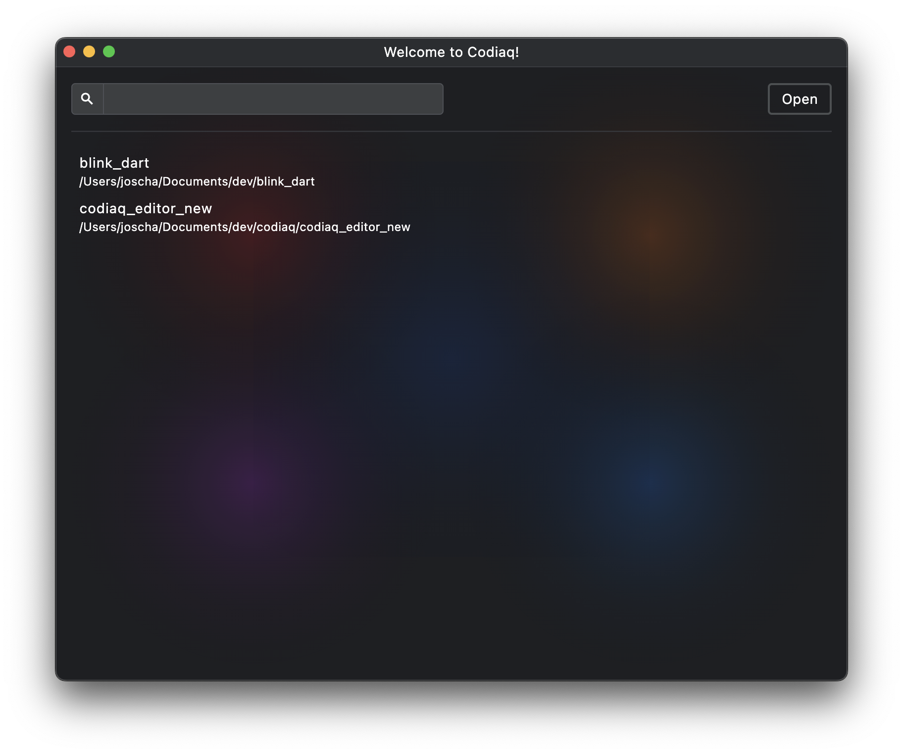
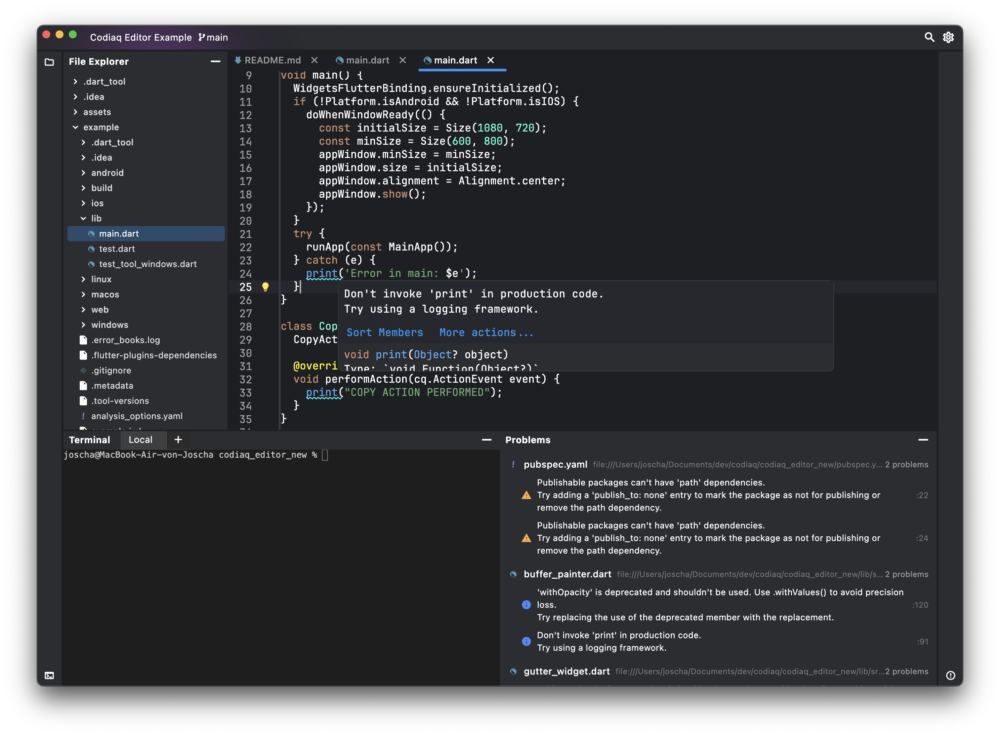

# codiaq
A code editor written in dart.

Currently still in development, but you can already try it
out by downloading it from the releases or go to https://codiaq.dev

Here are some screenshots of its current state:




### Development
Release a new alpha version:
```bash
git tag v1.0.0-alpha.24
git push origin v1.0.0-alpha.24
```
